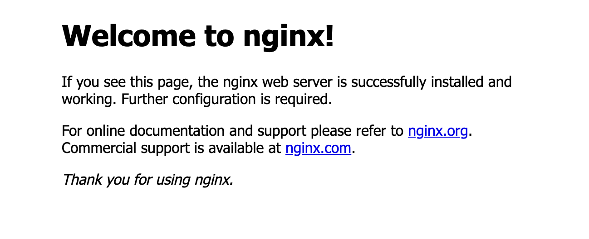

### Prepare a NGINX APP to deploy on a cluster gke

##### config-map.yaml
```
kubectl apply -f k8s/config-map.yaml
```
#### deployment.yaml
```
kubectl apply -f k8s/deployment.yaml
```

##### autoscaler.yaml
```
kubectl apply -f k8s/autoscaler.yaml
```

#### services.yaml
```
kubectl apply -f k8s/service.yml
```

### Result
<p align="center">
  
</p>

### Utils commands
```
kubectl get all
kubectl get pods
kubectl get services
kubectl get deployments
kubectl describe pod <POD_NAME> 
kubectl describe services <POD_NAME> 
kubectl describe deployments <POD_NAME>  
```